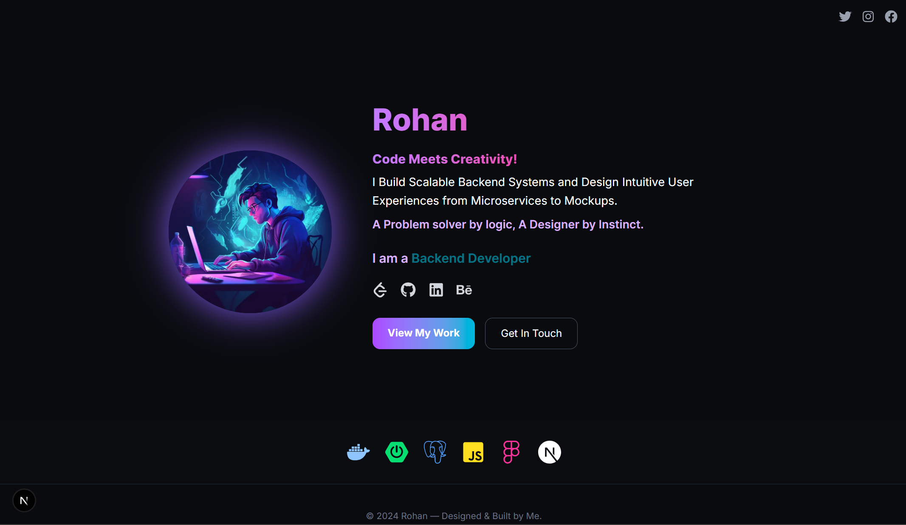

[](https://rohan-six.vercel.app/) <!-- Add a screenshot of your portfolio -->

# My Personal Portfolio

A modern, responsive personal portfolio website showcasing my journey as a Full Stack Developer and UI/UX Designer. Built with Next.js, TypeScript, and Tailwind CSS.

## ✨ Features

- **Modern Design**: Clean, contemporary UI with gradient effects and smooth animations
- **Responsive Layout**: Optimized for all devices (desktop, tablet, mobile)
- **Interactive Elements**:
  - Animated role transitions
  - Hover effects on social icons and tech stack
  - Modal contact popup using Headless UI Dialog
  - One-click email copy functionality with React Icons feedback
- **SEO Optimized**: Meta tags, structured data, and semantic HTML
- **Performance First**: Built with Next.js for optimal loading speeds
- **Accessibility**: WCAG compliant with proper ARIA labels and keyboard navigation

## 🛠️ Tech Stack

### Frontend

- **Next.js 15** - React framework for production
- **TypeScript** - Type-safe JavaScript
- **Tailwind CSS** - Utility-first CSS framework

### Key Dependencies

- **React Icons** - Comprehensive icon library (FaGithub, FaLinkedin, SiSpringboot, etc.)
- **Headless UI** - Unstyled, accessible UI components for modal/dialog functionality

### Development Tools

- **ESLint** - Code linting
- **PostCSS** - CSS processing
- **Inter Font** - Modern typography

## 🏗️ Project Structure

```
portfolio/
├── public/
│   ├── Profile.webp          # Profile image
│   ├── icon.png              # Favicon
│   └── portfolio-preview.png # Preview image
├── src/
│   ├── app/
│   │   ├── globals.css       # Global styles
│   │   ├── layout.tsx        # Root layout
│   │   └── page.tsx          # Home page component
│   └── components/           # Reusable components (if any)
├── package.json
├── tailwind.config.js
├── next.config.js
└── README.md
```

## 🚀 Getting Started

### Prerequisites

- Node.js 18.0 or later
- npm or yarn package manager

### Installation

1. **Clone the repository**

   ```bash
   git clone https://github.com/R0HAN9/portfolio.git
   cd portfolio
   ```

2. **Install dependencies**

   ```bash
   npm install
   # or
   yarn install
   ```

3. **Run the development server**

   ```bash
   npm run dev
   # or
   yarn dev
   ```

4. **Open your browser**
   Navigate to [http://localhost:3000](http://localhost:3000)

## 📝 Customization

### Personal Information

Update the following in `src/app/page.tsx`:

- Profile image path
- Personal description and roles
- Social media links
- Email address
- Skills/technologies

### Styling

- **Colors**: Modify the gradient colors in the component
- **Typography**: Update font weights and sizes
- **Animations**: Adjust transition durations and effects
- **Layout**: Modify spacing and component arrangement

### Adding New Sections

To add new sections (e.g., Projects, Experience):

1. Create new components in `src/components/`
2. Import and add them to the main page
3. Update the layout and styling accordingly

## 🎨 Design Features

- **Gradient Text Effects**: Eye-catching purple-to-cyan gradients
- **Glowing Profile Image**: Subtle shadow effect around profile picture
- **Animated Role Transitions**: Cycling through different professional roles
- **Interactive Modal**: Contact popup built with Headless UI for accessibility
- **Rich Icon Library**: React Icons for social media, tech stack, and UI elements
- **Copy-to-Clipboard**: Email copying with visual feedback using React Icons
- **Responsive Icons**: Technology stack displayed with recognizable brand icons
- **Smooth Transitions**: Hover effects and micro-interactions

## 📱 Responsive Design

The portfolio is fully responsive with breakpoints for:

- **Mobile**: 320px and up
- **Tablet**: 768px and up
- **Desktop**: 1024px and up
- **Large Desktop**: 1280px and up

## 🔍 SEO & Performance

- **Meta Tags**: Comprehensive SEO meta tags
- **Structured Data**: Schema markup for better search visibility
- **Image Optimization**: Next.js Image component for optimized loading
- **Font Loading**: Optimized Google Fonts loading
- **Core Web Vitals**: Optimized for Google's performance metrics

## 🚀 Deployment

### Vercel (Recommended)

1. Push your code to GitHub
2. Connect your repository to Vercel
3. Deploy with zero configuration

### Netlify

1. Build the project: `npm run build`
2. Deploy the `out` folder to Netlify

### Other Platforms

The portfolio can be deployed on any platform that supports Next.js applications.

## 🤝 Contributing

While this is a personal portfolio, suggestions and improvements are welcome!

1. Fork the repository
2. Create a feature branch (`git checkout -b feature/improvement`)
3. Commit your changes (`git commit -am 'Add some improvement'`)
4. Push to the branch (`git push origin feature/improvement`)
5. Create a Pull Request

## Let's Connect

**Rohan Gupta**

- **Email**: sde.rohangupta@gmail.com
- **LinkedIn**: [Gohan Gupta](https://www.linkedin.com/in/rohan-gupta-668458219/)
- **GitHub**: [R0HAN9](https://github.com/R0HAN9)
- **Behance**: [rhn27](https://www.behance.net/rhn27)
- **LeetCode**: [R0HAN_18](https://leetcode.com/u/R0HAN_18/)

---

⭐ **If you like this portfolio, please give it a star!** ⭐
